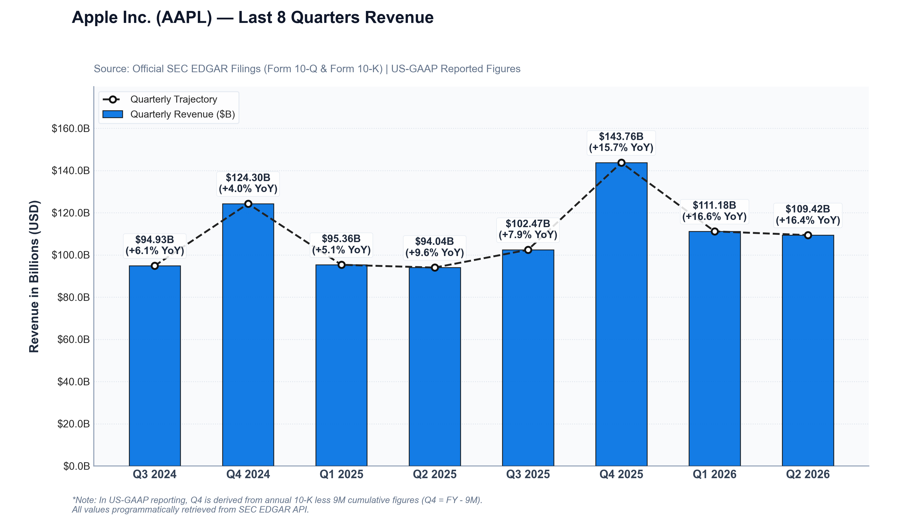

# sec-scraper

A fast, compliant Python tool to pull quarterly financial data (Revenue) directly from official SEC EDGAR XBRL filings by code, normalize US-GAAP reporting periods, and generate publication-quality financial charts.

| Tesla, Inc. (TSLA) | Apple Inc. (AAPL) |
| :---: | :---: |
|  |  |

---

## ✨ Features

- **SEC EDGAR API Ingestion**: Programmatically pulls official structured XBRL company facts adhering to SEC Fair Access guidelines.
- **US-GAAP Accounting Normalization**:
  - Handles standalone 3-month Form 10-Q quarters (Q1, Q2, Q3).
  - Accurately derives fourth-quarter figures from annual Form 10-K filings ($\text{Revenue}_{Q4} = \text{Revenue}_{FY} - \text{Revenue}_{9M}$).
  - Automatically identifies active revenue concepts across accounting changes (e.g. ASC 606 transition to `RevenueFromContractWithCustomerExcludingAssessedTax`).
- **Continuous Historical Series**: Guarantees an unbroken chronological sequence of quarterly periods with accurate YoY and QoQ growth rates.
- **Highly Configurable**: Control tickers, quarter count, output paths, directories, concepts, and formatting via CLI arguments, environment variables, or JSON configuration files.
- **Publication-Ready Visuals**: Renders brand-styled financial charts with custom color themes, trajectory overlays, and growth callouts.
- **Tabular Export**: Automatically saves structured CSV datasets including SEC accession numbers and filing dates.

---

## 📦 Project Structure

```text
sec-scraper/
├── sec_revenue_scraper.py             # Script entry point and legacy facade
├── sec_scraper/                       # Core modular package
│   ├── __init__.py
│   ├── chart.py                       # High-resolution financial chart renderer
│   ├── cli.py                         # Command-line pipeline orchestrator
│   ├── client.py                      # SEC EDGAR client with transport adapter seam
│   ├── config.py                      # Flexible configuration (CLI, env, JSON)
│   └── normalizer.py                  # US-GAAP normalization & Q4 derivation
├── tests/                             # Comprehensive unit & integration test suite
│   ├── conftest.py
│   ├── test_backward_compatibility.py
│   ├── test_chart.py
│   ├── test_cli.py
│   ├── test_client.py
│   ├── test_config.py
│   └── test_normalizer.py
├── data/
│   ├── aapl_revenue_last_8_quarters.csv   # Apple extracted revenue dataset
│   └── tesla_revenue_last_8_quarters.csv  # Tesla extracted revenue dataset
├── charts/
│   ├── aapl_revenue_last_8_quarters.png   # Apple financial chart
│   └── tesla_revenue_last_8_quarters.png  # Tesla financial chart
├── pyproject.toml                     # Modern package & build configuration
├── requirements.txt                   # Package dependencies
└── README.md                          # Documentation
```

---

## 🚀 Quick Start

### 1. Installation

Clone or download this repository, and install the required dependencies:

```bash
git clone https://github.com/glouize/sec-scraper.git
cd sec-scraper
pip install -r requirements.txt
```

### 2. Usage

Run the scraper for default company (**Tesla, Inc. [TSLA]**):

```bash
python sec_revenue_scraper.py
```

Query **Apple Inc. [AAPL]**:

```bash
python sec_revenue_scraper.py --ticker AAPL
```

Or query any other US-listed public company by ticker:

```bash
# Microsoft Corporation
python sec_revenue_scraper.py --ticker MSFT

# Nvidia Corporation
python sec_revenue_scraper.py --ticker NVDA
```

### 3. Command-Line Options & Configuration

| Flag | Short | Default | Description |
| :--- | :--- | :--- | :--- |
| `--ticker` | `-t` | `TSLA` | US ticker symbol or 10-digit SEC CIK |
| `--quarters` | `-n` | `8` | Number of quarters to extract and visualize |
| `--output-csv` | | `data/<ticker>_revenue_last_<n>_quarters.csv` | Custom output path for CSV dataset |
| `--output-chart` | | `charts/<ticker>_revenue_last_<n>_quarters.png` | Custom output path for chart PNG |
| `--data-dir` | | `data` | Directory for default CSV exports |
| `--charts-dir` | | `charts` | Directory for default chart exports |
| `--user-agent` | | `FinancialResearch/1.0 (...)` | SEC-compliant User-Agent header |
| `--concept` | | `Auto (latest recency)` | Explicit US-GAAP revenue concept override |
| `--config` | `-c` | `sec_scraper_config.json` (if present) | Path to JSON configuration file |
| `--no-chart` | | `False` | Extract CSV dataset only, skip chart rendering |
| `--quiet` | `-q` | `False` | Suppress console summary output |

#### Environment Variables

You can also configure pipeline defaults via environment variables:
- `SEC_TICKER`: Default ticker symbol (e.g. `AAPL`)
- `SEC_QUARTERS`: Default quarter count (e.g. `8`)
- `SEC_USER_AGENT`: SEC-compliant User-Agent header
- `SEC_OUTPUT_CSV`: Custom CSV export destination
- `SEC_OUTPUT_CHART`: Custom chart image export destination
- `SEC_CONCEPT`: Target US-GAAP concept override
- `SEC_NO_CHART`: Set to `true` to skip chart generation
- `SEC_QUIET`: Set to `true` to suppress console output

#### Configuration File

Create a `sec_scraper_config.json` file in your workspace or specify one with `--config path/to/config.json`:

```json
{
  "ticker": "AAPL",
  "quarters": 8,
  "data_dir": "data",
  "charts_dir": "charts"
}
```

---

## 📊 Sample Outputs

### Tesla, Inc. (TSLA)

```text
======================================================================
 Tesla, Inc. (TSLA) — Last 8 Quarters Revenue 
======================================================================
quarter period_end form  revenue_billions  qoq_growth_pct  yoy_growth_pct
Q3 2024 2024-09-30 10-Q       25.182          -1.247059        7.845824  
Q4 2024 2024-12-31 10-K       25.707           2.084822        2.145667  
Q1 2025 2025-03-31 10-Q       19.335         -24.787023       -9.229614  
Q2 2025 2025-06-30 10-Q       22.496          16.348591      -11.780392  
Q3 2025 2025-09-30 10-Q       28.095          24.888869       11.567787  
Q4 2025 2025-12-31 10-K       24.901         -11.368571       -3.135333  
Q1 2026 2026-03-31 10-Q       22.387         -10.095980       15.784846  
Q2 2026 2026-06-30 10-Q       28.236          26.126770       25.515647  
======================================================================
```

- **CSV Dataset**: [`data/tesla_revenue_last_8_quarters.csv`](data/tesla_revenue_last_8_quarters.csv)
- **Visual Chart**: [`charts/tesla_revenue_last_8_quarters.png`](charts/tesla_revenue_last_8_quarters.png)


---

### Apple Inc. (AAPL)

```text
======================================================================
 Apple Inc. (AAPL) — Last 8 Quarters Revenue 
======================================================================
quarter period_end form  revenue_billions  qoq_growth_pct  yoy_growth_pct
Q3 2024 2024-09-28 10-K       94.930          10.670693       6.069409   
Q4 2024 2024-12-28 10-Q      124.300          30.938586       3.951495   
Q1 2025 2025-03-29 10-Q       95.359         -23.283186       5.075314   
Q2 2025 2025-06-28 10-Q       94.036          -1.387389       9.628455   
Q3 2025 2025-09-27 10-K      102.466           8.964652       7.938481   
Q4 2025 2025-12-27 10-Q      143.756          40.296293      15.652454   
Q1 2026 2026-03-28 10-Q      111.184         -22.657837      16.595182   
Q2 2026 2026-06-27 10-Q      109.417          -1.589257      16.356502   
======================================================================
```

- **CSV Dataset**: [`data/aapl_revenue_last_8_quarters.csv`](data/aapl_revenue_last_8_quarters.csv)
- **Visual Chart**: [`charts/aapl_revenue_last_8_quarters.png`](charts/aapl_revenue_last_8_quarters.png)


---

## 🧪 Running Tests

The test suite includes unit tests for the SEC client, transport adapters, US-GAAP normalizer, chart generator, CLI, and configuration loader:

```bash
pytest -v
```

---

## 📜 SEC EDGAR Policy Compliance

This tool complies with the U.S. Securities and Exchange Commission (SEC) Fair Access Policy by transmitting a custom `User-Agent` header with contact details and limiting request concurrency.
