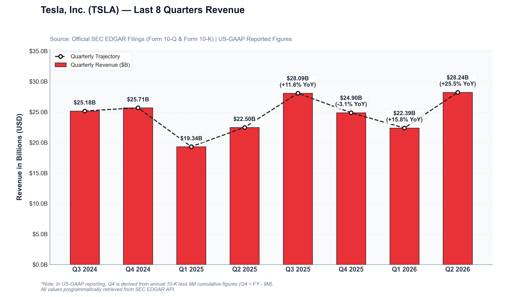

# sec-scraper

A fast, compliant Python tool to pull quarterly financial data (Revenue) directly from official SEC EDGAR XBRL filings by code, normalize US-GAAP reporting periods, and generate publication-quality financial charts.



---

## ✨ Features

- **SEC EDGAR API Ingestion**: Programmatically pulls official structured XBRL company facts adhering to SEC Fair Access guidelines.
- **US-GAAP Accounting Normalization**:
  - Handles standalone 3-month Form 10-Q quarters (Q1, Q2, Q3).
  - Accurately derives fourth-quarter figures from annual Form 10-K filings ($\text{Revenue}_{Q4} = \text{Revenue}_{FY} - \text{Revenue}_{9M}$).
- **Continuous 8-Quarter Series**: Guarantees an unbroken chronological sequence of the last 8 quarters.
- **Publication-Ready Visuals**: Renders styled financial charts with Quarter-over-Quarter (QoQ) and Year-over-Year (YoY) growth tags.
- **Tabular Export**: Automatically saves structured CSV datasets including SEC accession numbers and filing dates.

---

## 📦 Project Structure

```text
sec-scraper/
├── sec_revenue_scraper.py         # Main scraper and chart generator script
├── requirements.txt               # Python package dependencies
├── README.md                      # Project documentation
├── .gitignore                     # Git ignore rules
├── data/
│   └── tesla_revenue_last_8_quarters.csv  # Extracted tabular revenue dataset
└── charts/
    └── tesla_revenue_last_8_quarters.png  # Generated high-resolution chart
```

---

## 🚀 Quick Start

### 1. Installation

Clone or download this repository, and install the required dependencies:

```bash
git clone https://github.com/glouize/sec-scraper.git
cd sec-scraper
pip install -r requirements.txt
```

### 2. Usage

Run the scraper for default company (**Tesla, Inc. [TSLA]**):

```bash
python sec_revenue_scraper.py
```

Or query any other US-listed public company by ticker:

```bash
# Apple Inc.
python sec_revenue_scraper.py --ticker AAPL

# Microsoft Corporation
python sec_revenue_scraper.py --ticker MSFT

# Nvidia Corporation
python sec_revenue_scraper.py --ticker NVDA
```

### 3. Command-Line Options & Configuration

| Flag | Short | Default | Description |
| :--- | :--- | :--- | :--- |
| `--ticker` | `-t` | `TSLA` | US ticker symbol or 10-digit SEC CIK |
| `--quarters` | `-n` | `8` | Number of quarters to extract and visualize |
| `--output-csv` | | `data/<ticker>_revenue_last_<n>_quarters.csv` | Custom output path for CSV dataset |
| `--output-chart` | | `charts/<ticker>_revenue_last_<n>_quarters.png` | Custom output path for chart PNG |
| `--data-dir` | | `data` | Directory for default CSV exports |
| `--charts-dir` | | `charts` | Directory for default chart exports |
| `--user-agent` | | `FinancialResearch/1.0 (...)` | SEC-compliant User-Agent header |
| `--concept` | | `Auto (latest recency)` | Explicit US-GAAP revenue concept override |
| `--config` | `-c` | `sec_scraper_config.json` (if present) | Path to JSON configuration file |
| `--no-chart` | | `False` | Extract CSV dataset only, skip chart rendering |
| `--quiet` | `-q` | `False` | Suppress console summary output |

#### Environment Variables

You can also configure pipeline defaults via environment variables:
- `SEC_TICKER`: Default ticker symbol (e.g. `AAPL`)
- `SEC_QUARTERS`: Default quarter count (e.g. `8`)
- `SEC_USER_AGENT`: SEC-compliant User-Agent header
- `SEC_OUTPUT_CSV`: Custom CSV export destination
- `SEC_OUTPUT_CHART`: Custom chart image export destination
- `SEC_CONCEPT`: Target US-GAAP concept override
- `SEC_NO_CHART`: Set to `true` to skip chart generation
- `SEC_QUIET`: Set to `true` to suppress console output

#### Configuration File

Create a `sec_scraper_config.json` file in your workspace or specify one with `--config path/to/config.json`:

```json
{
  "ticker": "AAPL",
  "quarters": 8,
  "data_dir": "data",
  "charts_dir": "charts"
}
```

---

## 📊 Sample Output (Tesla, Inc. - TSLA)

```text
======================================================================
 Tesla, Inc. (TSLA) — Last 8 Quarters Revenue 
======================================================================
quarter period_end form  revenue_billions  qoq_growth_pct  yoy_growth_pct
Q3 2024 2024-09-30 10-Q       25.182                NaN            NaN   
Q4 2024 2024-12-31 10-K       25.707           2.084822            NaN   
Q1 2025 2025-03-31 10-Q       19.335         -24.787023            NaN   
Q2 2025 2025-06-30 10-Q       22.496          16.348591            NaN   
Q3 2025 2025-09-30 10-Q       28.095          24.888869      11.567787   
Q4 2025 2025-12-31 10-K       24.901         -11.368571      -3.135333   
Q1 2026 2026-03-31 10-Q       22.387         -10.095980      15.784846   
Q2 2026 2026-06-30 10-Q       28.236          26.126770      25.515647   
======================================================================
```

---

## 📜 SEC EDGAR Policy Compliance

This tool complies with the U.S. Securities and Exchange Commission (SEC) Fair Access Policy by transmitting a custom `User-Agent` header with contact details and limiting request concurrency.
